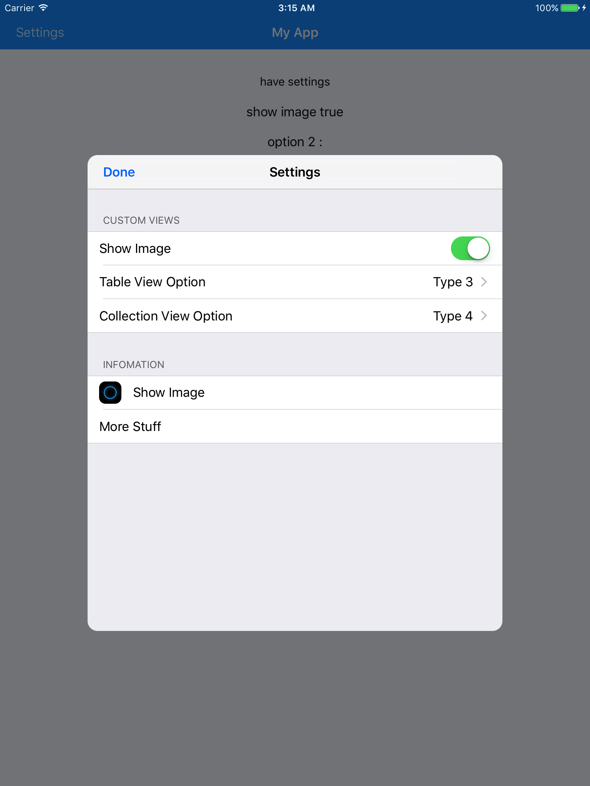

# App Settings

It's easy to create settings page with static UITableViewController.

With custom cell we can put any kind of controls that we want.

Just a caveat: the cell number is not dynamic, unless we code it with percision.

